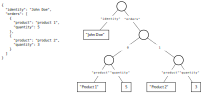

# Form handling in React

It's like formik, but different.

Features :
- Build form from any nested object/array (value, error, touched, ...)
- Handle validation on submit/change/blur
- Typesafe
- Partial validation
- Custom validation strategy

## How it works

Any nested object/array is a tree :

This is how the form state is kept internally (in a typesafe maner). Actuall values are ketp on the leaf of the tree. Each node on the tree have additional properties :
- `touched` : whether this node or a descendent has been touched (focused then blured)
- `dirty` : whether this node or a descendent has been changed
- `errors` : containing the errors for this node (not its descendents). Usually, on would only have errors for leaf nodes (strings, numbers ...), but sometimes, you want to validate a non leaf node, for exemple validate an array length, or some aggregate value (the sum of a `quantity` property for exemple).
- `validable` : whether the validation is activated for this node (no effects on descendents). You can skip validation for a node (since validation, as you will see, will validate multiple nodes).
- `validate` : a user defined method validating the value of this node (not its descendents).

### Changing

You can change the value of any node. The simplest case is changing the value of a leaf node. We simply ... change the value. For a non-leaf node, the changed value MUST have the same structure (same tree) with only different value in leafs (to avoid having to diff trees, which would be a PITA). Then it's simply a walk in the tree to update the leafs.

If you have to change the structure of the tree, it's usually in an array node. For this use case you have utils methods to modify its structure.

When you change a node, this node and all its descendents will be marked `dirty`, then all parents of the node will also be marked as `dirty` (so only siblings and theire descendent will not be marked as `dirty`).

### Bluring

Bluring has the same effect: this node and all its descendents will be marked `touched`, then all parents of the node will also be marked as `touched` (so only siblings and theire descendent will not be marked as `touched`).

### Validation

Validation can be triggered on any node. This will work the same way as a `dirty` or `touched` marking : we validate the node and all its descendents, then all parents of the node will also be validated. In this process we honor the `validable` flag of each node. The "validation path" on the tree will still be the same, we simply ignore some steps.

If we trigger validation at the root of the tree, we validate the whole form. But if we trigger validation at some node, only some nodes will be validated, leaving others untouched. This can be interesting if we have some expensive validation to run on some nodes, and want to avoid running it every time the whole form change.

